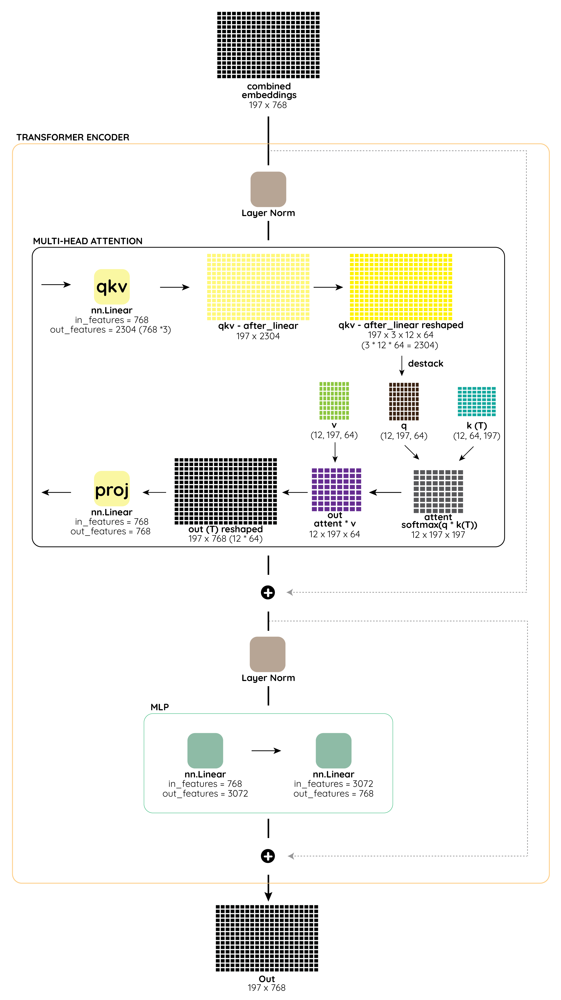

# Vision Transformers (ViT) Notes

The complete design is called Vision Transformer.

- Split image into patches and flatten
- Produce lower-dimensional embeddings from the smoothed patches
- Add positional embeddings
- Feed the grouping as a contribution to a standard transformer encoder
- Pretrain the model with image classes
- Finetune on the downstream dataset for classification



## Patch Embedding

Splits image into patches.

```
class PatchEmbeddings(nn.Module):
    def __init__(self, image_size=224, patch_size=16, num_channels=3, embed_dim=768):
        super().__init__()
        image_size = to_2tuple(image_size)
        patch_size = to_2tuple(patch_size)
        num_patches = (image_size[1] // patch_size[1]) * (image_size[0] // patch_size[0])
        self.image_size = image_size
        self.patch_size = patch_size
        self.num_patches = num_patches

        self.projection = nn.Conv2d(num_channels, embed_dim, kernel_size=patch_size, stride=patch_size)

    def forward(self, pixel_values):
        batch_size, num_channels, height, width = pixel_values.shape
        if height != self.image_size[0] or width != self.image_size[1]:
            raise ValueError(
                f"Input image size ({height}*{width}) doesn't match model ({self.image_size[0]}*{self.image_size[1]})."
            )
        x = self.projection(pixel_values).flatten(2).transpose(1, 2)
        return x
```

## ViT Embeddings

Create position embedding that learns distance within the same image.

Create CLS embeddings, which is a learnable class token parametrized by `nn.Parameter()`.

```
class ViTEmbeddings(nn.Module):
    """
    Construct the CLS token, position and patch embeddings.

    """

    def __init__(self, config):
        super().__init__()

        self.cls_token = nn.Parameter(torch.zeros(1, 1, config.hidden_size))
        self.patch_embeddings = PatchEmbeddings(
            image_size=config.image_size,
            patch_size=config.patch_size,
            num_channels=config.num_channels,
            embed_dim=config.hidden_size,
        )
        num_patches = self.patch_embeddings.num_patches
        self.position_embeddings = nn.Parameter(torch.zeros(1, num_patches + 1, config.hidden_size))
        self.dropout = nn.Dropout(config.hidden_dropout_prob)

    def forward(self, pixel_values):
        batch_size = pixel_values.shape[0]
        embeddings = self.patch_embeddings(pixel_values)

        cls_tokens = self.cls_token.expand(batch_size, -1, -1)
        embeddings = torch.cat((cls_tokens, embeddings), dim=1)
        embeddings = embeddings + self.position_embeddings
        embeddings = self.dropout(embeddings)
        return embeddings
```
